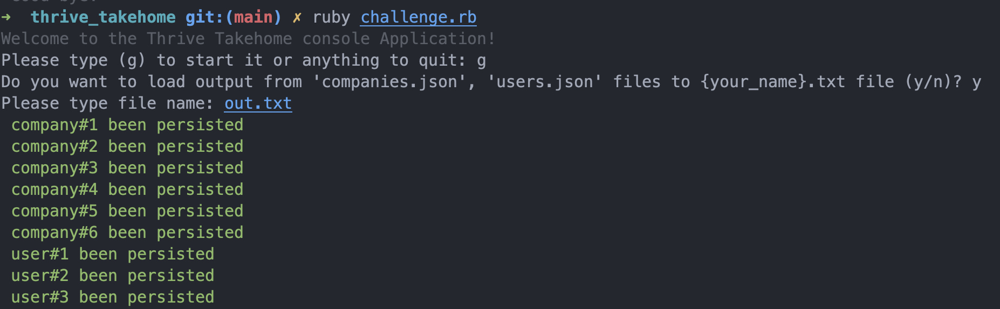

# Documentation
Here below documentation provided for accomplished task for the Thrive Challenge.

## Author:
```
Oleg Saltykov 

oleg.saltykov@gmail.com
```

## Build instruction:

This application built using using Ruby 3.1.2 with several 
application dependencies listed at the [Gemfile](Gemfile)

For starting given rails application locally it is required to run next console commands:

```console
bundle install      # install all Ruby gems
```
As intended for running console application need to trigger [challenge.rb](challenge.rb) over the console

```console
ruby challenge.rb
```
Follow simple Q&A suggested int the app for output result to target txt file. 
## Flow examples


## Error Handling
- If an error occurs during the fetching data, you will get error message displayed over the console


## Notes
- Unit tests and manual testing is available. So that can prove correctness in some fashion.
- Code might be not the cleanest and test coverage only covered base one record assembling case. But I hope it brings main idea.

## THANK YOU!

